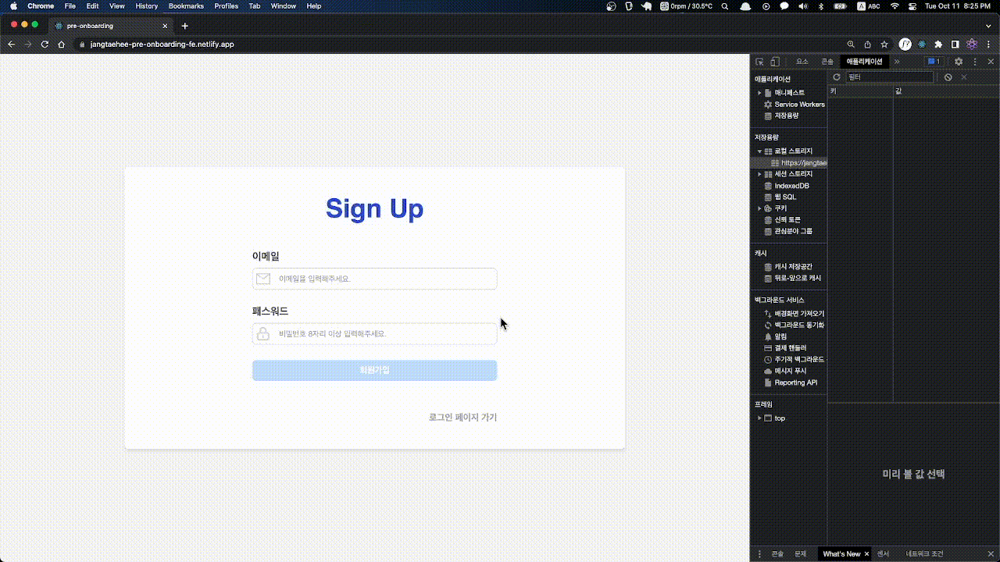

<div>
    <h1>JangTaeHee_pre-onboarding task</h1>
    <span>✅ 링크 : </span>
    <a display="block" href="https://jangtaehee-pre-onboarding-fe.netlify.app" >
      https://jangtaehee-pre-onboarding-fe.netlify.app
    </a>
</div>

<br /><br />

## Content

- 🛠 [Built with](#built-with)
- 🚀 [Project](#project)

---

<br />

## Built with

### ✓ Library

- `react-router-dom`
- `styled-components`
- `react-icons`

### ✓ Deploy

- `netlify`

---

<br />

### ✓ Project

##### 설치 및 실행 방법

```zsh
$ npm install
$ npm start
```

> 회원가입·로그인

- 이메일과 패스워드를 입력해야만 회원가입·로그인이 가능합니다.
- 이메일 형식 ( `@` ) 이여야만 회원가입·로그인할 수 있습니다.
- `비밀번호는 8자리 이상`이여야만 회원가입·로그인할 수 있습니다.
- 회원가입·로그인 양식에 맞지 않거나 중복된 이메일은 에러 메시지를 확인할 수 있습니다.
- 회원가입이 완료된다면 로그인 페이지로 이동할 수 있습니다.
- 이미 회원가입 한 유저라면 `회원가입 버튼` 하단에 `로그인 페이지` 클릭하여 로그인 페이지로 이동할 수 있습니다.
- 로그인이 완료된다면 `localStorage`에 `token`이 저장되며 투두 리스트 페이지로 이동됩니다.
- 이미 로그인된 유저라면 회원가입·로그인 페이지로 이동할 수 없고, 투두 리스트페이지로 즉시 이동됩니다.
  <br /><br />

  

<br /><br />

> 투두리스트

- navbar에서 현재 요일과 날짜를 확인할 수 있습니다.
- 로그아웃을 할 수 있습니다.
- 로그아웃하면 `localStorage`에 `token` 제거되며, 회원가입 페이지로 이동합니다.
- 입력창을 통해 todo를 추가할 수 있습니다.  
  → 입력하지 않는다면 추가할 수 없습니다.
- 개별 todo를 `수정(✎) 및 삭제(ⅹ)`를 할 수 있습니다.
- todo을 완료했다면 체크박스에서 체크할 수 있습니다.  
  → `완료된 todo는 수정할 수 없으며`, 삭제만 가능합니다.
- 수정 모드에서는 todo 수정하거나 수정을 취소할 수 있습니다.  
   → `수정모드에서는 완료 체크를 할 수 없습니다.`
  <br /><br />

  

<br /><br />
